<div align="center">
  
</div>

```text
+-------------------------------------------------------------+
|    __              _                                        |
|   / /_  ______  (_)___  __  ___________ _                   |
|  / / / / / __ \/ /_  / / / / / ___/ __ `/                   |
| / / /_/ / / / / / / /_/ /_/ / /  / /_/ /                    |
|/_/\__,_/_/ /_/_/ /___/\__,_/_/   \__,_/                     |
|                                                             |
|  Informatics Undergraduate @ Universitas Sebelas Maret      |
+-------------------------------------------------------------+
```

<div align="center">


<br/>

[](https://uns.ac.id/)
[](https://github.com/lunizura)
[](https://github.com/lunizura)
[](https://github.com/lunizura)
[](https://github.com/lunizura)

<br/><br/>



</div>

---

> [!NOTE]
> **Active Learner & Open to Guidance**
> I am currently an undergraduate student actively learning and expanding my skills across these domains. Always humble, eager to improve, and open to constructive feedback, guidance, code reviews, and mentorship. If you have advice or spot areas for improvement in any of my projects, feel free to reach out or open an issue!

### About Me

- **Education:** Computer Science / Informatics undergraduate at **Universitas Sebelas Maret (UNS)**.
- **Low-Level & Security:** Passionate about binary reverse engineering, process memory architectures, and executable analysis.
- **Game Modding:** Developing memory modifiers, pointer path resolvers, and real-time process patches.
- **3D Modeling & Art:** Designing stylized 3D assets, low-poly models, and game props using Blender.
- **Mathematics:** Deeply interested in discrete mathematics, number theory, graph theory, and algorithmic complexity.
- **Gaming & Media:** Tactical and strategy RPG enthusiast, simulation lover, and avid anime fan.

---

### Tech Stack & Toolchain

<div align="center">

#### Languages


#### Systems, Security & Reverse Engineering


#### 3D Modeling & Creative


#### Development & Infrastructure


</div>

---

### Featured Projects

| Project | Description | Stack |
|---|---|---|
| [keketatan-univ-indonesia](https://github.com/lunizura/keketatan-univ-indonesia) | Comprehensive national university selectivity portal tracking competition density across 50 top Indonesian universities. | HTML5, CSS3, JavaScript, Python |
| [ugm-prodi-directory](https://github.com/lunizura/ugm-prodi-directory) | Bilingual interactive directory of 74 Universitas Gadjah Mada programs with real-time quota calculations and modal deep-dives. | JavaScript, HTML5, Python Suite, CI/CD |
| [itb-prodi-directory](https://github.com/lunizura/itb-prodi-directory) | Bilingual academic catalog of Institut Teknologi Bandung covering 52 study programs across all faculties and campuses. | Vanilla JS, CSS3 Grid, Python CI |
| [uns-prodi-directory](https://github.com/lunizura/uns-prodi-directory) | Academic program directory for Universitas Sebelas Maret featuring quota breakdowns and curriculum pathways. | JavaScript, JSON Dataset, HTML5 |
| [ui-prodi-directory](https://github.com/lunizura/ui-prodi-directory) | Universitas Indonesia undergraduate program directory with admission metrics and bilingual academic guides. | JavaScript, Python Test Suite |

---

<div align="center">
  <sub>Open-source enthusiast, reverse engineer, 3D artist, and continuous learner.</sub>
  <br/><br/>
  
</div>
